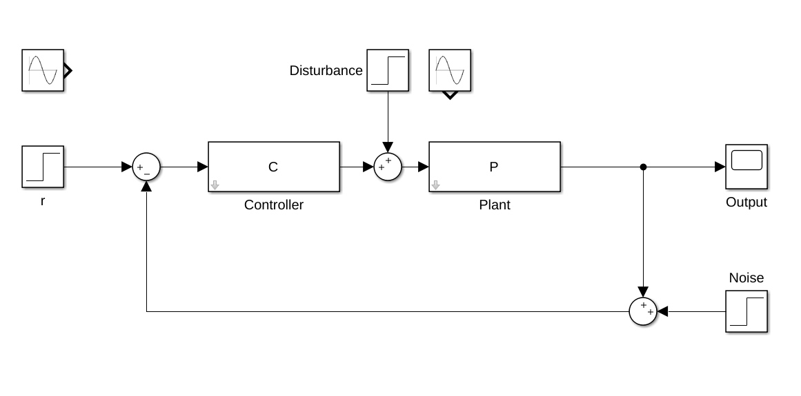
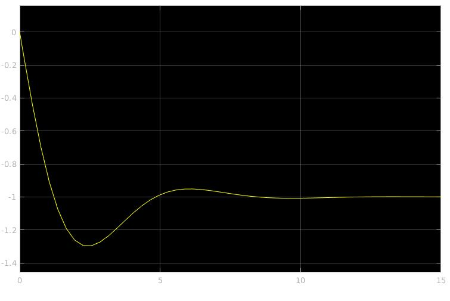

### Simulink Block Diagram



### Input case 1



### Input case 2


### Discrete PI Controller Function

`controller.m`

```matlab
function u = controller(e, d_t)

    % control gains
    kp = 2;
    ki = 1;

    persistent integral
    if isempty(integral)
        integral = 0;
    end
    integral = integral + e*d_t;

    u = kp*e + ki*integral;
end
```


